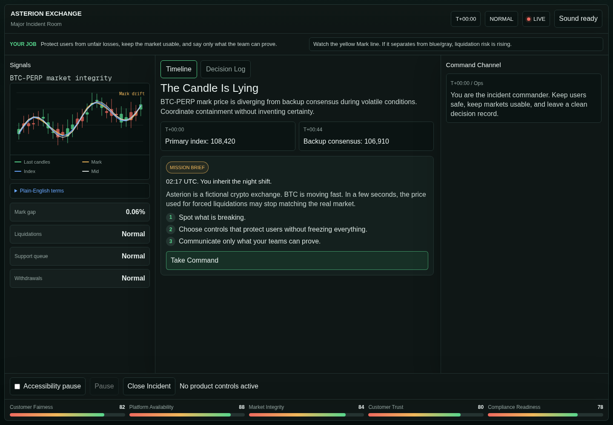
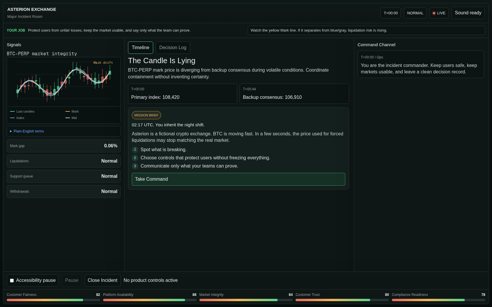
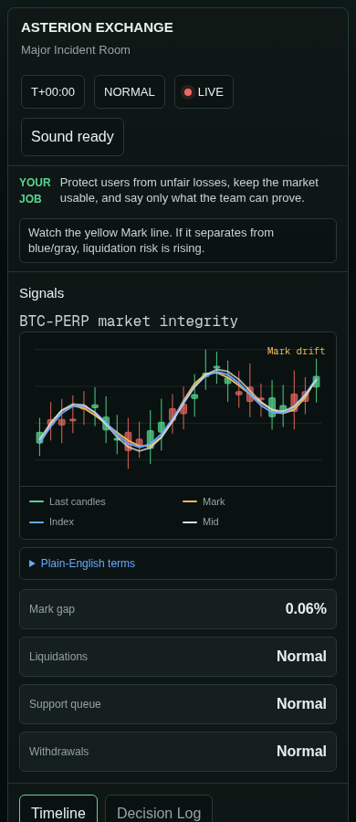

# ExchangeOps: Incident Commander

A playable crypto exchange crisis simulation.

[Play the live demo →](https://exchangeops.seangaolab.com)

<table>
  <tr>
    <td></td>
    <td></td>
  </tr>
</table>

## About the simulation

**ExchangeOps** is a short browser simulation about running a crypto exchange through a bad market-data event.

You are on call at Asterion, a fictional exchange. BTC-PERP's mark price starts drifting away from other price sources. Liquidations rise, support tickets pile up, and a rumor begins to spread.

Your job is to decide what to pause, what to keep running, what to tell users, and how to leave a decision record that can stand up to review.

There is no perfect run. Every action protects one thing while putting pressure on something else.

## Inspiration

This project was built around the operational problems that sit behind a trading screen: price-source failures, liquidation controls, support backlogs, withdrawal rumors, escalation calls, and the uncomfortable gap between what a team knows and what users need to hear.

The scenario is fictional, but the trade-offs are intended to feel familiar to people who work around exchanges, market infrastructure, risk, support, or incident response.

## How it works

1. Monitor a rapidly changing exchange incident.
2. Make operational decisions with incomplete information.
3. Review the customer, market, trust, and compliance consequences in a post-incident report.

## Episode 01: The Candle Is Lying

BTC-PERP's mark price diverges from backup consensus during volatile conditions. The player must manage abnormal-liquidation risk, user complaints, market controls, withdrawal rumors, and an evidence-led recovery process.

## What the experience demonstrates

| Capability | Demonstrated through |
| --- | --- |
| Incident Management | Severity declaration, escalation, coordination, and recovery |
| Product Operations | Operational trade-offs and service-continuity decisions |
| Trading Operations | Mark-price controls, liquidation handling, and reduce-only mode |
| Risk Operations | Evidence review, customer-impact containment, and control selection |
| Customer Operations | Support surges, public communication, and trust management |
| Post-incident Review | Decision timeline, outcomes, missed evidence, and recommendations |

## Design principles

- Incomplete information
- Time pressure
- Trade-offs instead of perfect answers
- Delayed and explainable consequences
- Evidence-led communication

## Fictional scenario and limitations

This is a fictional simulation created for learning, design exploration, and operational storytelling.

- All companies, exchange names, systems, characters, metrics, messages, prices, accounts, and events are fictional.
- The simulation does not use live market data, exchange APIs, customer data, wallet data, or trading functionality.
- Decisions, outcomes, and scores are simplified for interactive learning. They do not constitute operational, legal, compliance, security, financial, or trading advice.
- The experience does not guarantee that a similar response would be appropriate in a real-world incident.

Any resemblance to real exchanges, products, systems, events, persons, incidents, or operational procedures is purely coincidental.

## Feedback

This is an evolving simulation. Feedback from people working in product operations, exchange operations, trading, market infrastructure, risk, support, compliance, and incident management is welcome.

If you spot an unrealistic assumption, missing trade-off, unclear decision, or better operational control, please open an issue.

## Repository note

This repository contains project documentation and media. The live simulation is available at the link above.
